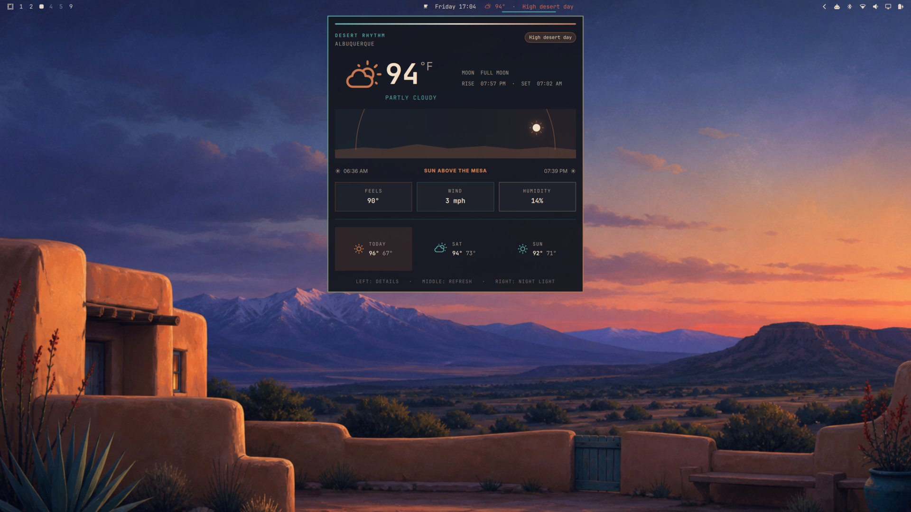

# Santa Fe for Omarchy



A dark [Omarchy](https://omarchy.org/) theme inspired by Santa Fe at blue
hour: adobe, turquoise, chili red, desert sage, warm sand, and deep twilight
blue.

## Install

```bash
omarchy theme install https://github.com/majesticio/omarchy-santa-fe-theme
```

Or install through **Omarchy Menu → Install → Style → Theme** using the same
GitHub URL.

## Included

- A complete semantic and ANSI palette in `colors.toml`
- Santa Fe shell surfaces, gradients, controls, menus, and lock styling
- `Yaru-wartybrown-dark` icon integration
- An original 16:9 high-desert wallpaper
- A 16:9 theme preview

Omarchy generates terminal, shell, Hyprland, editor, and application colors
from the palette when the theme is applied.

## Optional Desert Rhythm widget

The companion [Desert Rhythm plugin](https://github.com/majesticio/omarchy-desert-rhythm-plugin)
adds a time-aware desert sun to the bar. It cycles through dawn, high-desert
day, golden hour, and night; it also provides shortcuts for wallpaper cycling,
night light, and weather status.

```bash
omarchy plugin add https://github.com/majesticio/omarchy-desert-rhythm-plugin --enable --yes
```

## Palette

| Role | Color |
| --- | --- |
| Background | `#1C2026` |
| Foreground | `#E7D7C6` |
| Accent / turquoise | `#55AAA6` |
| Chili red | `#D6674F` |
| Chamisa gold | `#D7A84D` |
| Desert sage | `#88A870` |
| Twilight blue | `#718FC6` |
| Adobe | `#C8784F` |

## Artwork

The wallpaper is original AI-assisted artwork created specifically for this
theme. It contains no third-party artwork, text, logos, or watermarks.

## License

MIT. See [LICENSE](LICENSE).
